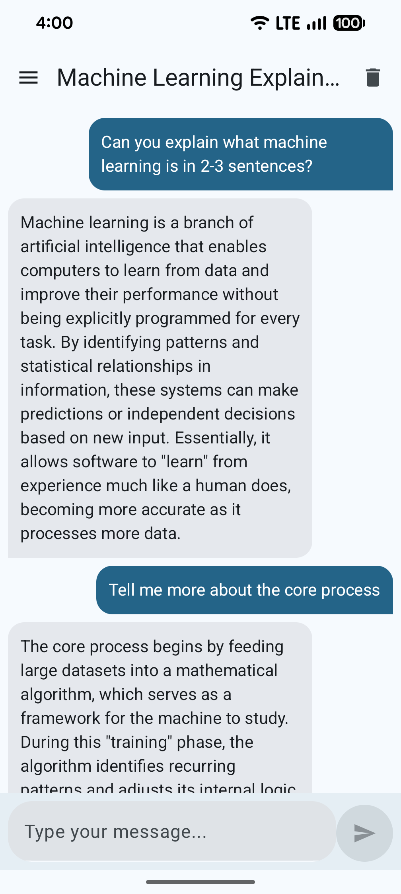
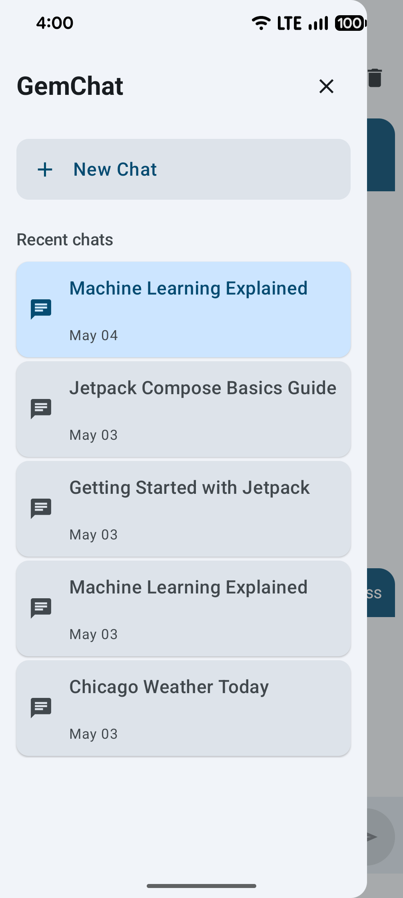
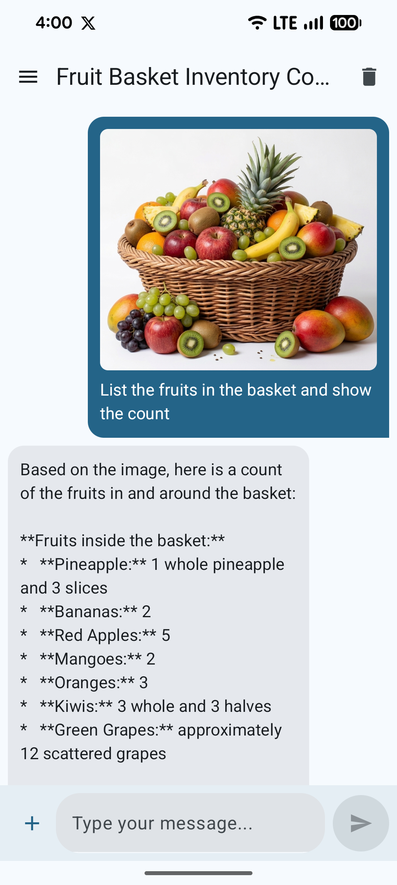
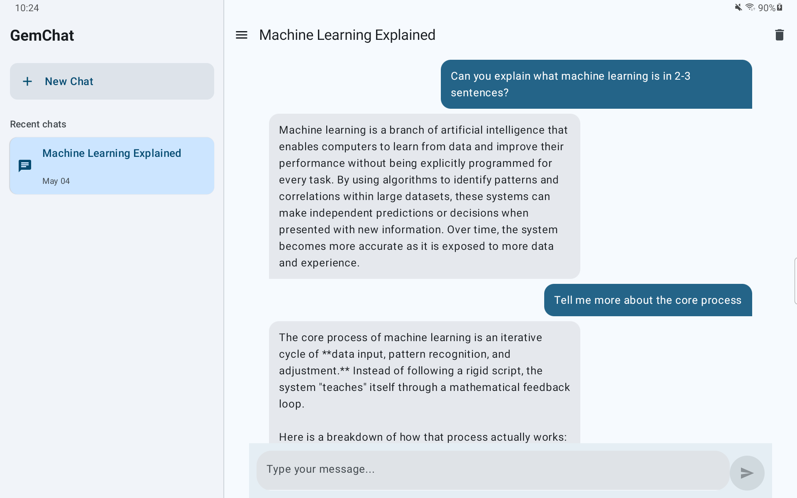
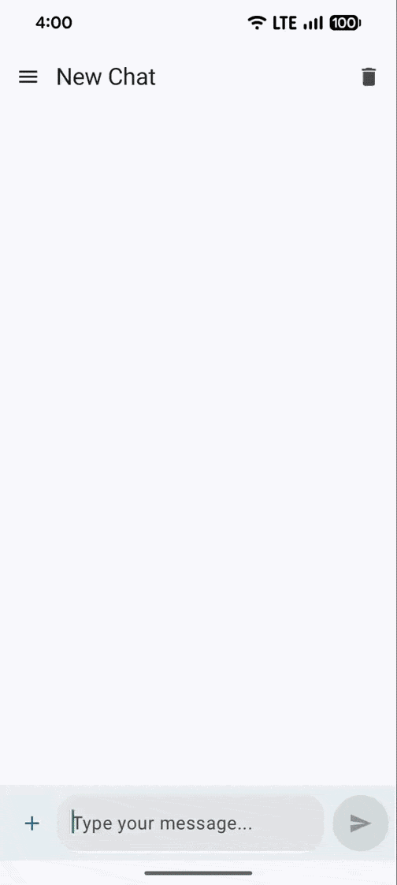

# GemChat

Latest release: v1.0.0 — see `CHANGELOG.md` and `docs/release-notes/v1.0.0.md`

A modern Android chat application powered by **Firebase AI** and **Gemini Flash**. This is a sample project demonstrating best practices in multi-modular Android development with Jetpack Compose, Kotlin Coroutines, and Firebase integration.

> 📚 **Learning Project** | 🔓 **Open Source** | 🎯 **Production-Ready Architecture**

## Features

- 💬 **Real-time Text Chat** - Powered by Gemini Flash API via Firebase AI
- 🗂️ **Chat History** - Persistent storage using Room database
- 📱 **Responsive Design** - Optimized for both mobile and tablet screens
- 🏗️ **Multi-Modular Architecture** - Scalable feature-based module structure
- 📅 **Smart Calendar Event Scheduling** - Tool/function calling enables natural-language scheduling: Gemini can resolve contacts, check availability, and create calendar events automatically. See `docs/calendar-event-tool-calling.md` and the `:tools:calendar` module for implementation details.
- 🚀 **Modern Tech Stack** - Kotlin, Compose, Coroutines, and more
- 🎨 **Material Design 3** - Beautiful and intuitive UI

## Screenshots & Demo

### Screenshots

| Chat Screen | Chat History | Image Analysis |
| :---: | :---: | :---: |
|  |  |  |

#### Tablet View
<p align="center">
  
</p>

### Demo

| Text Chat | Image Analysis |
| :---: | :---: |
|  |  |

## Tech Stack

- **Language:** Kotlin 2.3.21
- **UI Framework:** Jetpack Compose (2026.04.01)
- **AI Integration:** Firebase AI with Gemini Flash
- **Database:** Room 2.8.4
- **Dependency Injection:** Koin 4.2.1
- **Asynchronous Programming:** Kotlin Coroutines 1.10.2
- **Navigation:** Jetpack Navigation Compose 2.9.8
- **Serialization:** Kotlinx Serialization 1.11.0
- **Min SDK:** Android 5.0+ (API 21+)
- **Target SDK:** Latest (API 35+)

## Project Architecture

This project follows a **multi-modular, feature-based architecture** for better scalability, testability, and team collaboration.

### Module Structure

```
geminiproj/
├── app/                          # Main application module
├── core/                         # Core libraries and utilities
│   ├── ai/                       # Firebase AI & Gemini integration
│   ├── common/                   # Common utilities and extensions
│   ├── data/                     # Data layer (repositories, data sources)
│   ├── model/                    # Domain models and entities
│   └── ui/                       # Shared UI components and themes
├── features/                     # Feature modules (can be developed independently)
│   ├── chat/                     # Chat feature
│   ├── image/                    # Image generation feature (Coming soon)
│   └── text/                     # Text generation utilities
├── tools/                        # Tools and integrations (e.g., calendar-event-tool-calling)
└── build-logic/                  # Custom Gradle plugins & conventions
```

### Architecture Principles

- **Clean Architecture** - Separation of concerns with data, domain, and presentation layers
- **Feature Modularity** - Each feature is a semi-independent module
- **Dependency Injection** - Koin for automatic dependency management
- **Reactive & Async** - Kotlin Coroutines for non-blocking operations
- **Local First** - Chat history stored locally with Room

## Prerequisites

- **Android Studio** (Latest version recommended)
- **JDK 17** or higher
- **Gradle 8.0+**
- **Android API 21+**
- **Firebase Project** (free or paid plan)

## Getting Started

### 1. Clone the Repository

```bash
git clone https://github.com/ajrajthala/AjGeminiProj.git
cd AjGeminiProj
```

### 2. Update Your Package Name

The default package is `com.aj.geminiproj`. You need to rename it to your own:

1. In Android Studio: `Refactor` → `Rename` → Choose your new package name
2. Update `build.gradle.kts` (app module) with your new package name
3. Update any references in `settings.gradle.kts` if needed

### 3. Set Up Firebase

Follow the official Firebase setup guide to create a new project and obtain the `google-services.json` file:

👉 **[Firebase Setup Guide](https://firebase.google.com/docs/android/setup)**

Steps summary:
1. Go to [Firebase Console](https://console.firebase.google.com/)
2. Create a new project
3. Add Android app with your package name
4. Download `google-services.json`
5. Place it in `app/google-services.json`

**Important:** Use the same package name you set in Step 2!

### 4. Build and Run

```bash
./gradlew build        # Build the project
./gradlew installDebug # Install on device/emulator
```

Or simply run from Android Studio: `Shift + F10` (or `Run` button)

## Module Documentation

### Core Modules

- **core/ai** - Firebase AI integration, Gemini Flash API wrapper
- **core/data** - Repository implementations, Room database setup
- **core/ui** - Shared Compose components, themes, and design system
- **core/common** - Utility functions and Kotlin extensions
- **core/model** - Data classes, entities, and domain models

### Feature Modules

- **features/chat** - Main chat UI and chat history
- **features/image** - Image generation (Coming soon)
- **features/text** - Text generation utilities

### Tools Modules

- **tools/calendar-event-tool-calling** - Tool module demonstrating function/tool calling for calendar-event automation; see `docs/calendar-event-tool-calling.md` for full documentation.

## Build Configuration

This project uses **custom Gradle plugins** (in `build-logic/`) to standardize module configurations:

- `geminiproj-android-application-compose` - App module with Compose
- `geminiproj-android-compose` - Compose library modules
- `geminiproj-android-library` - Standard Android library modules
- `geminiproj-kotlin-library` - Pure Kotlin modules
- `geminiproj-android-room` - Modules using Room database
- `geminiproj-kotlin-serialization` - Modules using Kotlinx Serialization

## Contributing

We welcome contributions! This is a learning project, and PRs are encouraged to help improve the codebase.

### Guidelines

1. **Create a feature branch** - `git checkout -b feature/your-feature-name`
2. **Make your changes** - Follow Kotlin coding conventions
3. **Test thoroughly** - Add or update tests as needed
4. **Create a Pull Request** - Describe your changes clearly
5. **Review process** - Maintainers will review and merge

### Code Style

- Follow the [Kotlin Style Guide](https://kotlinlang.org/docs/coding-conventions.html)
- Use meaningful variable and function names
- Add comments for complex logic
- Keep functions small and focused

## Roadmap

### Current Version
- ✅ Text chat with Gemini Flash
- ✅ Chat history storage with Room
- ✅ Mobile and tablet support
- ✅ Modern Android architecture

### Coming Soon
- 🚧 **Image Generation** - Generate images using Gemini's capabilities
- 🚧 **Gemini Nano** - On-device inference for offline capabilities
- 🚧 **Enhanced Persistence** - Cloud backup of chat history
- 🚧 **Advanced UI Features** - Rich message formatting, reactions

## Troubleshooting

### Build Issues

**Gradle sync fails:**
- Invalidate caches: `File` → `Invalidate Caches` → `Invalidate and Restart`
- Update Gradle: `./gradlew wrapper --gradle-version=latest`

**Firebase setup issues:**
- Ensure `google-services.json` is in the correct location (`app/` folder)
- Verify your package name matches the Firebase project
- Check that your API keys are enabled in Firebase Console

### Runtime Issues

**Chat not responding:**
- Ensure you have internet connection
- Check Firebase project credentials in `google-services.json`
- Verify Gemini Flash API is enabled in your Firebase project

## License

This project is open source and available under the **MIT License**. See the [LICENSE](LICENSE) file for details.

## Questions & Support

- 📖 **Documentation:** Check the inline code comments and module README files
- 🐛 **Found a bug?** Open an [Issue](https://github.com/ajrajthala/AjGeminiProj/issues)
- 💭 **Have a question?** Start a [Discussion](https://github.com/ajrajthala/AjGeminiProj/discussions)

---

**Happy coding!** 🚀

*This is a sample project built to demonstrate modern Android development practices.*

